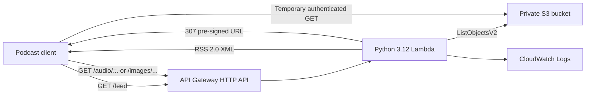

# rssfid

`rssfid` is a serverless RSS 2.0 feed generator for an S3-backed podcast. An
AWS Lambda function lists audio objects in a private S3 bucket, renders an RSS
feed with Apple Podcasts metadata, and serves it through an API Gateway HTTP
API. Audio and artwork stay private in S3 and are delivered through short-lived
pre-signed URL redirects.

The project is designed for a small personal podcast and uses Free Tier-conscious
defaults: Python 3.12, 128 MB Lambda memory, a 29-second timeout, S3-managed
encryption, and seven-day CloudWatch log retention.

> [!IMPORTANT]
> The S3 bucket is private, but the API Gateway routes are public. Anyone who
> knows the feed URL can read the RSS feed and follow its media links. This is
> not an authenticated or access-controlled podcast feed.

## Features

- Generates RSS 2.0 XML with the Apple Podcasts `itunes` namespace.
- Discovers `.mp3`, `.wav`, `.m4a`, `.aac`, `.ogg`, and `.flac` objects through
  paginated S3 listings.
- Percent-encodes spaces and non-ASCII S3 keys in enclosure URLs.
- Returns exact S3 object sizes and extension-based MIME types in enclosures.
- Serves cover art, episode artwork, and audio through one-hour S3 pre-signed
  URLs while keeping the bucket blocked from public access.
- Provisions S3, Lambda, API Gateway, CloudWatch, and least-privilege IAM with
  Terraform.
- Tests all application branches with `pytest` and `moto`; CI enforces 100%
  statement and branch coverage without contacting AWS.

## Architecture



Terraform derives the globally unique bucket name as
`<project_name>-audio-<aws_account_id>`; no account ID, bucket name, endpoint,
email address, or podcast metadata is committed to the repository.

## HTTP routes

| Route | Response |
| --- | --- |
| `GET /feed` | RSS 2.0 XML; cached by clients for five minutes. |
| `GET /cover` | `307` redirect to the S3 object `images/cover.png`. |
| `GET /audio/{key}` | `307` redirect to the requested audio object. |
| `GET /images/{key}` | `307` redirect to an object below `images/`. |

Audio files whose basename starts with `<number>.` automatically reference
`images/<number>.png` as episode artwork. For example,
`3. Introduction.m4a` maps to `images/3.png`.

## Repository layout

```text
src/handler.py                 Lambda entry point and RSS renderer
tests/                         moto-backed pytest suite
infra/main.tf                  S3, Lambda, API Gateway, and CloudWatch
infra/iam.tf                   Lambda execution role and policies
infra/variables.tf             Deployment inputs
infra/outputs.tf               Feed, cover, bucket, and log outputs
infra/terraform.tfvars.example Safe configuration example
.github/workflows/ci.yml        Tests, Terraform checks, and manual deploy
docs/STATE.md                  Current security and release notes
```

Local Terraform state, real variable files, build artifacts, IDE settings,
audio, and artwork are intentionally ignored by Git. Podcast media belongs in
the deployed S3 bucket and can be many times larger than GitHub's file limits.

## Prerequisites

- Python 3.12 or newer for local development.
- Terraform 1.5 or newer.
- An AWS account and AWS credentials available through the standard AWS SDK
  credential chain, such as an AWS profile or environment variables.
- Permission to create S3, Lambda, API Gateway v2, CloudWatch Logs, and IAM
  resources in the selected account.

AWS may charge for deployed resources when account allowances are exceeded.
Review the plan before applying it.

## Local development

Create and activate a virtual environment, then install the test dependencies:

```powershell
python -m venv .venv
.\.venv\Scripts\Activate.ps1
python -m pip install --upgrade pip
python -m pip install -r requirements-dev.txt
```

Run the full test and coverage gate:

```powershell
python -m pytest tests --cov=src --cov-branch --cov-report=term-missing --cov-fail-under=100
```

All AWS calls in the test suite are intercepted by `moto`. The credentials in
`tests/conftest.py` are deliberately fake test values.

## Configuration with environment variables

Terraform automatically reads environment variables named `TF_VAR_<variable>`.
Using them keeps personal values out of source files and command history. Set
the required podcast metadata in the current shell before planning or applying:

```powershell
$env:TF_VAR_podcast_title = "My Podcast"
$env:TF_VAR_podcast_description = "A short description of the podcast"
$env:TF_VAR_podcast_author = "Publisher name"
$env:TF_VAR_podcast_owner_name = "Owner name"
$env:TF_VAR_podcast_owner_email = "owner@example.com"

# Optional overrides
$env:TF_VAR_aws_region = "us-east-1"
$env:TF_VAR_project_name = "rssfid"
$env:TF_VAR_environment = "prod"
$env:TF_VAR_podcast_language = "en"
$env:TF_VAR_podcast_category = "Education"
```

| Terraform variable | Environment variable | Required | Default | Purpose |
| --- | --- | :---: | --- | --- |
| `podcast_title` | `TF_VAR_podcast_title` | Yes | — | RSS channel title. |
| `podcast_description` | `TF_VAR_podcast_description` | Yes | — | RSS and Apple Podcasts summary. |
| `podcast_author` | `TF_VAR_podcast_author` | Yes | — | Apple Podcasts author. |
| `podcast_owner_name` | `TF_VAR_podcast_owner_name` | Yes | — | Owner display name. |
| `podcast_owner_email` | `TF_VAR_podcast_owner_email` | Yes | — | Owner email published inside the RSS feed. |
| `aws_region` | `TF_VAR_aws_region` | No | `us-east-1` | AWS deployment region. |
| `project_name` | `TF_VAR_project_name` | No | `rssfid` | Resource-name and tag prefix. |
| `environment` | `TF_VAR_environment` | No | `prod` | Environment tag. |
| `podcast_language` | `TF_VAR_podcast_language` | No | `en` | BCP 47 feed language. |
| `podcast_category` | `TF_VAR_podcast_category` | No | `Education` | Apple Podcasts top-level category. |

As an alternative, copy `infra/terraform.tfvars.example` to
`infra/terraform.tfvars` and edit it locally. Real `*.tfvars` files are ignored
and must never be committed.

The Lambda runtime receives its own environment variables from Terraform:
`BUCKET_NAME`, `PODCAST_TITLE`, `PODCAST_DESCRIPTION`, `PODCAST_AUTHOR`,
`PODCAST_LINK`, `PODCAST_IMAGE_URL`, `PODCAST_LANGUAGE`, `PODCAST_CATEGORY`,
`PODCAST_OWNER_NAME`, and `PODCAST_OWNER_EMAIL`. The API URL, cover URL, and
bucket name are derived from provisioned resources rather than supplied by a
person.

## Deploy to AWS

Authenticate with AWS through your preferred standard mechanism. For example,
select an existing local profile without putting credentials in the repository:

```powershell
$env:AWS_PROFILE = "my-aws-profile"
```

Then initialize, review, and apply the Terraform configuration:

```powershell
terraform -chdir=infra init
terraform -chdir=infra fmt -check -recursive
terraform -chdir=infra validate
terraform -chdir=infra plan -out=tfplan
terraform -chdir=infra apply tfplan
```

Read the generated resource names and URLs:

```powershell
terraform -chdir=infra output
```

## Upload podcast media

Use the Terraform output instead of hard-coding the account-specific bucket
name:

```powershell
$bucket = terraform -chdir=infra output -raw s3_bucket_name
aws s3 cp ".\audio\episode-001.mp3" "s3://$bucket/episode-001.mp3"
aws s3 cp ".\images\cover.png" "s3://$bucket/images/cover.png"
aws s3 cp ".\images\1.png" "s3://$bucket/images/1.png"
```

To upload a whole local media directory, use `aws s3 sync` only after checking
that the source directory contains exactly the files intended for this bucket.
The Lambda reads object size and modification time directly from S3, so a new
feed request reflects uploads without a separate database or index.

## Listen in YouTube Music with the RSS feed

Google's current podcast player is YouTube Music. It can add a podcast directly
from its RSS URL in the Android or iOS app. Google requires an adult (18+)
account for RSS subscriptions. See the official
[YouTube Music RSS instructions](https://support.google.com/youtubemusic/answer/13946190).

### 1. Deploy the feed and upload media

Complete the Terraform deployment and upload at least one supported audio file
to the generated S3 bucket. Upload `images/cover.png` as well if the podcast
should display cover artwork.

### 2. Copy the public feed URL

Read the URL from the Terraform state instead of copying an account-specific
API Gateway hostname into documentation or source code:

```powershell
$feedUrl = terraform -chdir=infra output -raw rss_feed_url
$feedUrl
```

The value should be an HTTPS URL ending in `/feed`, for example
`https://<api-id>.execute-api.<region>.amazonaws.com/feed`.

### 3. Verify the feed before adding it

The feed must be reachable from the public internet because YouTube Music fetches
it from Google's servers. Check the response from a machine with internet access:

```powershell
$response = Invoke-WebRequest -Uri $feedUrl -UseBasicParsing
$response.StatusCode
$response.Headers["Content-Type"]
```

Expect status `200` and a content type beginning with `application/rss+xml`.
Opening `$feedUrl` in a browser should also display or download XML containing
an `<rss>` element and at least one `<item>` after media has been uploaded.

### 4. Add the RSS URL in the YouTube Music mobile app

1. Open **YouTube Music** on Android or iOS and sign in with an adult Google
   Account.
2. Tap **Library**.
3. Select **Podcasts** at the top of the screen.
4. Tap **Add podcast** in the bottom-right corner.
5. Select **Add a podcast by RSS feed**.
6. Read and accept Google's RSS-feed disclaimer.
7. Paste the `$feedUrl` value from step 2.
8. Tap **Add**.
9. Wait for the show to appear under **Library → Podcasts**. Google says most
   feeds appear within minutes, although some take longer. RSS-based shows have
   an RSS badge next to their title.

### 5. Listen and optionally download episodes

1. Open **Library → Podcasts** and select the newly added show.
2. Select an episode and tap **Play**.
3. To listen later without a connection, open the episode menu and select
   **Download** when that option is available.

Google documents that podcast downloads are generally available without a
Premium membership, although some shows or episodes may not support an
audio-only download. See the official
[offline listening guide](https://support.google.com/youtubemusic/answer/6313535).
Most podcasts can also continue playing in the background without Premium.

You do not need to re-add the URL after uploading another episode. YouTube Music
periodically refreshes the same feed. `rssfid` asks clients to cache the RSS XML
for five minutes, and YouTube Music may take additional time to fetch an update.

### Troubleshooting YouTube Music

| Problem | What to check |
| --- | --- |
| **Add a podcast by RSS feed** is missing | Confirm that this is the YouTube Music mobile app and that the signed-in Google Account is an adult account. |
| YouTube Music rejects the URL | Use the `rss_feed_url` Terraform output, including HTTPS and the final `/feed`; do not paste the `/cover` URL or an S3 URL. |
| The feed returns an error | Run the verification command above, confirm the Lambda and S3 bucket still exist, then inspect the `cloudwatch_log_group` Terraform output. |
| The show appears without episodes | Upload at least one file with a supported audio extension and request `/feed` again to confirm that the XML contains an `<item>`. |
| Artwork is missing | Upload the cover as `images/cover.png`. For numbered episode files such as `1. Introduction.mp3`, upload episode artwork as `images/1.png`. |
| An episode is listed but will not play | Confirm that its S3 object still exists and that its `/audio/...` enclosure URL returns a `307` redirect rather than `404` or `502`. |

RSS-added shows do not support every native YouTube Music feature. Google lists
audio/video switching, likes and dislikes, sharing, channel pages, reporting,
and captions as unavailable. Google also warns that the RSS host can receive the
listener's IP address. In this project, both the feed URL and its API routes are
public, so do not treat possession of the URL as strong access control.

## GitHub Actions configuration

The workflow runs tests and offline Terraform validation on every push and pull
request. Deployment is intentionally manual through **Actions → RSS Feed
Generator CI/CD → Run workflow**, so publishing or merging source code cannot
silently change an AWS account.

Before using the deploy job, create these GitHub repository or `production`
environment values:

| GitHub Variables | Required | Maps to |
| --- | :---: | --- |
| `AWS_REGION` | No | AWS region; falls back to `us-east-1`. |
| `PROJECT_NAME` | No | `TF_VAR_project_name`; falls back to `rssfid`. |
| `DEPLOYMENT_ENVIRONMENT` | No | `TF_VAR_environment`; falls back to `prod`. |
| `PODCAST_TITLE` | Yes | `TF_VAR_podcast_title`. |
| `PODCAST_DESCRIPTION` | Yes | `TF_VAR_podcast_description`. |
| `PODCAST_AUTHOR` | Yes | `TF_VAR_podcast_author`. |
| `PODCAST_OWNER_NAME` | Yes | `TF_VAR_podcast_owner_name`. |
| `PODCAST_OWNER_EMAIL` | Yes | `TF_VAR_podcast_owner_email`. |
| `PODCAST_LANGUAGE` | No | Feed language; falls back to `en`. |
| `PODCAST_CATEGORY` | No | Podcast category; falls back to `Education`. |

Store `AWS_ACCESS_KEY_ID` and `AWS_SECRET_ACCESS_KEY` as GitHub **Secrets**, not
Variables. Scope the corresponding AWS principal to the resources and actions
needed by this Terraform configuration. For stronger controls, protect the
`production` GitHub Environment with required reviewers.

## Security and privacy notes

- Terraform state can contain account IDs, resource identifiers, endpoint URLs,
  and podcast metadata. It is ignored and must be stored securely. For team use,
  configure a protected remote backend before sharing state.
- The owner email is deliberately included in the generated RSS XML. Use a
  role-based or alias address if a personal email should not be public.
- S3 public access is blocked and objects use S3-managed AES-256 encryption at
  rest. Media downloads use pre-signed URLs that expire after one hour.
- The Lambda role can list only the generated podcast bucket and read objects
  below that bucket. It has no write or delete permission.
- API Gateway currently has no authentication, rate limiting, or subscriber
  token. Add an authorization layer before treating the feed URL as confidential.
- Do not commit AWS keys, `terraform.tfvars`, Terraform state, plans, generated
  Lambda archives, local media, IDE settings, or captured API endpoints.

## Remove deployed resources

Review the destroy plan, then remove resources when they are no longer needed:

```powershell
terraform -chdir=infra plan -destroy
terraform -chdir=infra destroy
```

Terraform cannot delete a non-empty S3 bucket. Back up any media you need, then
empty the exact generated bucket before running `destroy`.

## Current limitations

- The feed and redirect routes are public and have no subscriber authentication.
- Episode duration is emitted as `0`; the Lambda does not inspect audio metadata.
- Episode titles come from S3 keys and are not backed by a separate metadata
  manifest.
- The deployment uses the default API Gateway hostname; custom domains are not
  provisioned.
- Terraform state is local unless you add a remote backend.
